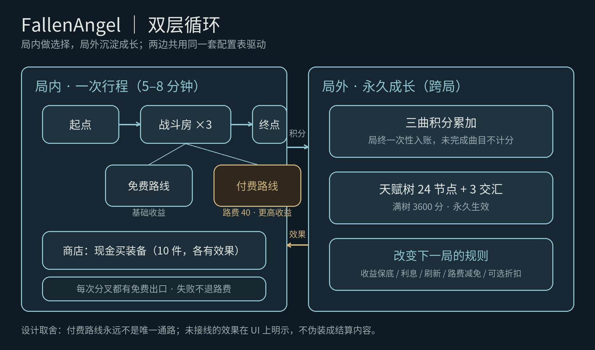
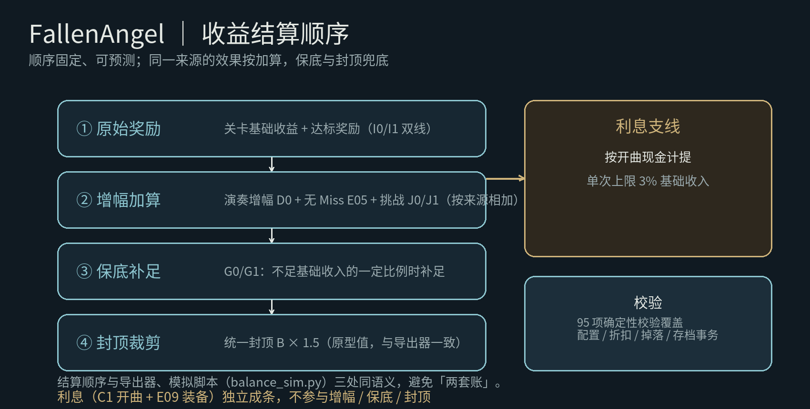
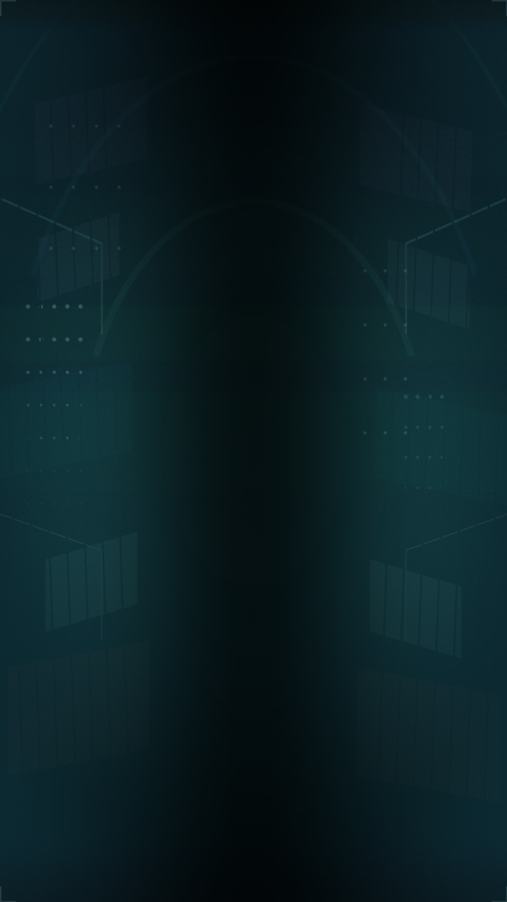
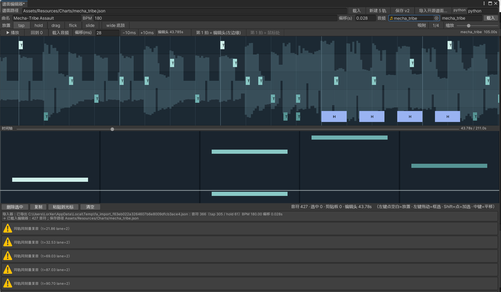

# FallenAngel

竖屏下落式 **roguelike 音游**，独立开发，Unity 2022.3 / C#。

把「打歌」包进一局 roguelike 行程：每局沿路线图做取舍，局终把成果沉淀成永久成长。

> 单人项目：玩法设计、系统与数值、程序实现、内容与美术管线。开发中以 AI 承担实现层，设计决策与真机验证由作者负责。

| 玩法与循环 | 数值验证 | 美术管线 |
| --- | --- | --- |
|  |  |  |
| **双层循环**：单局演奏 → 局内路线取舍 → 永久成长 | **收益构成**：技能水平与经济向成长各贡献多少 | **局内背景**：美术管线产出的局内资产 |

---

## 一、这个项目想解决什么

音游的即时反馈很强，但几乎没有长线目标——打完一首歌，除了一行分数，什么都没有留下。

FallenAngel 的做法是把单局演奏装进两层循环：

```
演奏 → 结算现金与成长积分 → 局内路线取舍（商店 / 战斗 / 空房）→ 通关
     → 成长积分解锁永久天赋 → 下一局受益
```

演奏水平被翻译成局内经济实力，游玩时长被翻译成永久成长，两条线在结算页汇合。

---

## 二、核心玩法

### 2.1 一曲多谱

同一首曲子按真实乐谱拆成不同声部的谱面，玩家承担鼓手、吉他手等乐手职责。

谱面不是凭手感听出来的，而是**从乐谱映射出来的**：

```
MuseScore 乐谱 → MusicXML → 转换器 → 游戏谱面 JSON
```

往返校验零差异（730 音符测试用例）。谱面格式已支持 4 键鼓谱与 5 键吉他谱两套轨道布局（吉他模式为规划中）。

### 2.2 演奏层

- 4 键鼓谱主路径（D / F / J / K），5 键布局已实现（加 G）
- 判定窗口参考 Phigros：±80 / 160 / 180 / 200 ms，长按尾部 ×1.5
- 音符类型：tap / hold / drag / flick / slide（含跨轨路径）+ 全宽底鼓
- 节拍校准：观察式校准（测纯设备延迟，不混入个人反应习惯），偏移持久化
- 竖屏 1080×1920 基准，PC 键盘与触屏双输入

### 2.3 局内与局外

| 层 | 内容 |
| --- | --- |
| 局内 | 9 节点路线图（战斗房 / 商店 / 空房），免费与付费分叉；三次演奏累积收益 |
| 局外 | 24 节点天赋树 + 3 处交汇，永久改变下一局规则 |

---

## 三、系统与数值

### 3.1 收益结算管线

按固定顺序结算，保证可预测：

```
原始奖励 → 增幅（按来源加算）→ 保底补足 → 封顶
```

利息类收益独立成条，不参与增幅、保底与封顶，避免被重复放大。

全部 31 条效果**表驱动**：新增一条效果是加一行配置，而不是在结算代码里加一个分支。

### 3.2 数值验证

`balance_sim.py` 按与游戏内同一套规则模拟 **15 局 × 5 种子 × 3 档水平**，用真实数据回答"玩家水平到底值不值钱"。

第一次跑出来的结论不太好听：**技能水平几乎不改变收益，真正给钱的是经济向天赋与装备**。据此重调收益系数与付费路线成本后复跑（113 / 116 / 146）——新手与普通仍然几乎重合，说明技能向效果还没接进结算，这是下一版要解决的结构问题。

### 3.3 设计的诚实边界

- 已设计但未接入结算的效果，在 UI 上如实标注，不让玩家误读成 bug
- 付费分叉永远保留一条免费出口，避免 roguelike 随机把人卡死
- 31 条效果规格里区分「已实现」与「已定未实现」

---

## 四、内容生产工具链

### 4.1 通用谱面编辑器

工程内自建的 5 轨谱面编辑器（`Assets/Scripts/Core/ChartEditorWindow.cs`）：

- 音频波形对齐、边编边试听、`[` `]` 微调偏移、以光标对齐第 1 拍
- 框选与多选、复制 / 粘贴 / 原地复制、跨轨拖动、拖动缩放时长
- 60 步撤销重做
- 实时合法性校验（同轨同刻重复、同刻超 2 音、时长有效性）
- 内置开源谱面导入



打开方式：`Tools > FallenAngel > Chart Editor`。界面为中文——这是给单人作者用的工具，不是面向玩家的产品。

### 4.2 谱面转换与导入

- 乐谱链路：`mscz → MusicXML → chart`，往返零差异
- 音频分析：BPM / 拍点检测、HPSS 声源分离、16 分网格频谱分类
- 开源谱面导入：osu!mania / StepMania / PEC / Phigros
- 自动生成谱面在质量评估不达标后弃用，改为人工打谱，工具降级为参考——`chart_tools/` 保留了下来

---

## 五、美术管线

- **方向探索**：ComfyUI + ControlNet / SDXL 跑通 7 套工作流（`art_tools/ai_imagegen/`），先定方向再动手
- **交付件产出**：图标、组件、房间符号由同一份几何定义同时产出游戏内网格与 SVG/PNG 交付件（40 件）——游戏内表现与导出素材同源，不会各改各的

> `art_tools/ai_imagegen/out/` 是生成产物目录，体积大，不入库；保留的是工作流与脚本。

---

## 六、工程与验证

- **分层**：`Core`（状态机 / 会话 / 存档事务）+ `Data`（只读配置表）+ `UI` + `Gameplay`（音符 / 判定）+ `Audio` + `Input`
- **事务性存档**：修订号 + 校验和，写失败不产生副作用、可重试；被截断的合法 JSON 不会被当成新档
- **可无头运行的验证体系**：95 项配置与存档事务确定性校验 + 27 项图标几何自检，均可用 `-batchmode -executeMethod` 运行
- **计时约束**：时间一律取 `GameManager.SongTime`，无音频时用虚拟时钟兜底
- 多语言：中 / 英

---

## 七、AI 协作方式

这个项目的实现层大部分由 AI 完成，设计决策与真机验证由作者负责。

- **主力**：Claude Code + DeepSeek V4 Pro/Flash；复杂推理用 GPT-6 Astra；Cursor、Trae 做过评估
- **选型标准**是真实生产约束——token 成本与等待输出的时间成本，而不是跑分（Trae 因输出慢弃用，Cursor、ChatGPT 因订阅费用弃用）
- **让 AI 产出可验证**：`CLAUDE.md` 划定 AI 的可改范围，`compile_check.sh` 在每次提交前跑无头编译自检，另有上述配置与几何自检

---

## 八、怎么跑起来

```
Unity 2022.3.x 打开工程 → Tools > FallenAngel > Build Default Game Scene → Play
PC：D / F / J / K 击打，SPACE 暂停，ESC 退出
手机：屏幕下半部按轨等分触屏
谱面编辑器：Tools > FallenAngel > Chart Editor
编译自检：关闭 Unity 编辑器后执行 ./compile_check.sh
```

---

## 九、音频与第三方素材说明

**本仓库不包含任何音频文件。**

音频体积较大，且本项目早期用于测试的曲目来自第三方，为避免公开分发他人作品，`Assets/Resources/Audio/` 已在 `.gitignore` 中排除，仅在本地保留。

游戏在缺少音频时使用虚拟时钟兜底，因此克隆仓库后工程仍可正常打开与运行（演奏无声）。

同样地，`_refs/`（第三方开源参考谱面）未入库。

完整的第三方清单见 [`THIRD_PARTY_NOTICES.md`](THIRD_PARTY_NOTICES.md) 与 [`LICENSES/`](LICENSES/)：
思源黑体的 SIL OFL 全文就近放在 `Assets/Fonts/SourceHanSans-OFL.txt`；TextMesh Pro 走 Unity Companion License（官方只附链接）；
TMP 示例里的 Anton / Bangers / Oswald / LiberationSans 为 OFL、**Roboto 为 Apache-2.0**（全文见 `LICENSES/Apache-2.0-Roboto.md`）、
EmojiOne 表情图与 Electronic Highway Sign 字体建议随发行版一并清理（见 `THIRD_PARTY_NOTICES.md` 2.2）。
本仓库的授权分两部分：代码 MIT（`LICENSE-CODE`）、内容保留所有权利（`LICENSE-ASSETS`），索引见 `LICENSE`。

---

## 十、目录结构

```
Assets/Scripts/     游戏代码（Core / Data / UI / Gameplay / Audio / Input）
Assets/Resources/   谱面、本地化文案
chart_tools/        谱面分析、转换、导入与规则引擎
art_tools/          美术方向工作流与几何导出管线
docs/               项目说明、架构约定、谱面转换协议、编辑器说明、待办清单（正文中文，每篇顶部带英文摘要）
portfolio/          作品集素材与图表
compile_check.sh    无头编译自检
CLAUDE.md           AI 协作约定（可改范围、验证要求、提交纪律）
```

---

<!-- English -->

## English

**FallenAngel** is a vertical-scrolling **roguelike rhythm game** built solo in Unity 2022.3 / C#.

A single run is a few minutes of route decisions on a 9-node map (battle, shop and empty rooms, with free and paid branches); run rewards then settle into a 24-node permanent talent tree. The design problem: rhythm games give strong moment-to-moment feedback but almost no long-term goal.

**Highlights**

- **One song, many charts** — the score is split by instrument so the player takes on a band role such as drums or guitar. Charts are converted from MuseScore scores through MusicXML with a zero-diff round-trip check, and the chart format supports both a 4-key drum layout and a 5-key guitar layout.
- **Systems and economy** — a fixed-order settlement pipeline (base reward → bonuses by source → floor → cap), with interest settled outside the bonus and cap; all 31 effects are config-driven.
- **Balance verified with a purpose-built simulator** — 15 runs × 5 seeds × 3 skill tiers running the game's own rules, which surfaced that player skill barely moved income while economic talents did.
- **General-purpose chart editor** — audio-waveform alignment, playback while editing, box/multi-select copy-paste, 60-step undo/redo, live validity checks, and built-in import of osu!mania / StepMania / PEC / Phigros charts.
- **Art pipeline** — ComfyUI + ControlNet/SDXL to fix an art direction, with in-game assets and exported deliverables produced from one shared geometry definition so the two cannot drift apart.
- **Headless verification** — 95 config and save-transaction determinism checks plus 27 icon-geometry checks, runnable without opening the editor.

**How it was built**: AI wrote most of the implementation (Claude Code + DeepSeek V4 Pro/Flash), while design decisions and real-device testing were the author's. Tools are chosen on token cost and time-to-output rather than benchmarks; `CLAUDE.md` scopes what the model may touch and `compile_check.sh` keeps AI output verifiable before every commit.

#### Commit rhythm

Development moved in small, verifiable steps, and the commit history shows it. Representative commits, translated:

| Commit | What it did |
| --- | --- |
| `chore: AI collaboration groundwork (git baseline + .gitignore + CLAUDE.md + compile check)` | Set the working rules before touching gameplay |
| `fix: single clock source — AudioManager owns time, fixing dual-clock drift` | A rhythm game cannot have two clocks; this removed the race and the early BGM countdown |
| `feat: chart toolchain + three auto-generated charts (drums/bass/synth)` | Built the analysis pipeline that was later demoted to a reference tool |
| `feat: notation-to-chart protocol finalised (v2 five note types + two-stage rule pipeline)` | Locked the mapping contract before implementing it |
| `feat: guitar-chart conversion finished and then dropped (output archived, hand-charting instead)` | Decided the automated result was not good enough, and said so |
| `feat: 5-lane chart editor — waveform alignment / playback / preview / multi-select paste / Alt-zoom` | Authoring tools, not just gameplay |
| `feat: open-source chart importers (osu!mania / StepMania) + first real chart in game` | Content interoperability |
| `feat: note parts (head/tail) + simultaneous-note connectors + 16 geometry self-checks` | Feature work lands with the checks that prove it |
| `chore: third-party audio kept local, not published with the repository` | Licensing handled before going public |

Two habits show up throughout: every change states how it was verified, and features land together with the checks that prove them (95 configuration and save-transaction checks, 27 icon-geometry checks, both runnable headlessly).

**Audio**: this repository contains no audio files. See section 9 above.
